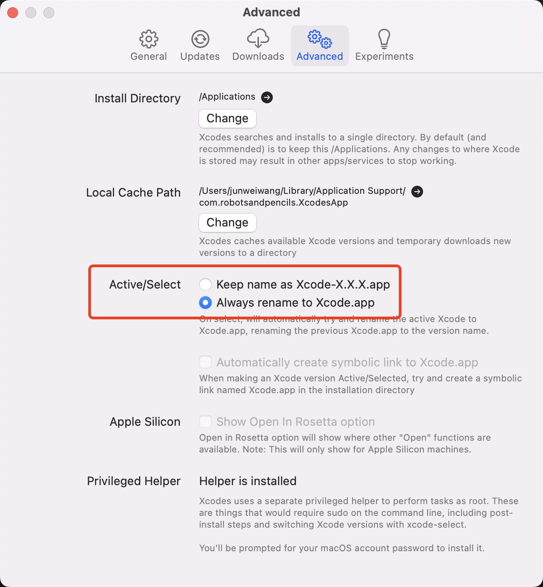
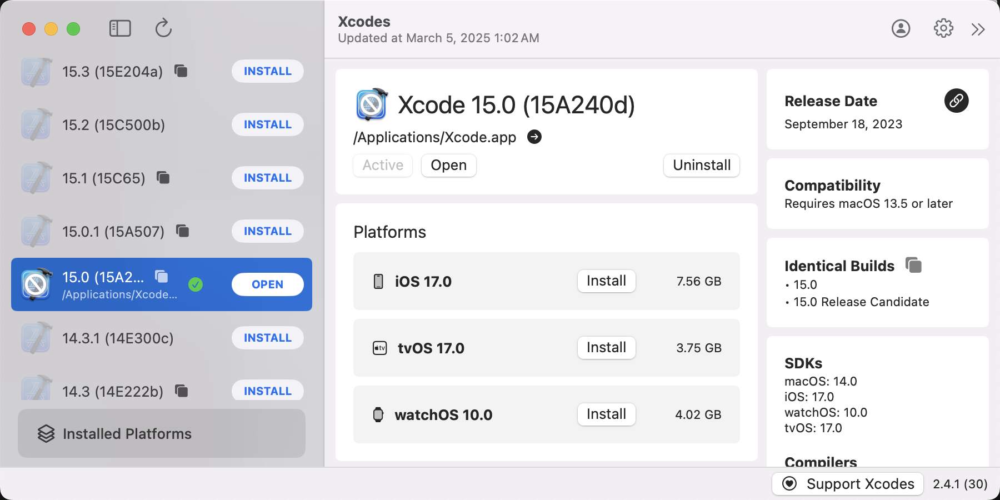

# qt-everywhere-src-6.5.5

This project was meant to help build QT 6.5.5 (an older version of QT) on new MacOS. Especially for Apple silicon. This is because some software is currently dependent on this version of QT.

Later in the future, this may or may not work.

Tested on Apple M1 Max (MacOS 15.0.1) on March 6, 2025.

## Steps to reproduce

1. You can choose to directly [download](https://download.qt.io/archive/qt/6.5/6.5.5/src/single/) the source code for 6.5.5 for clone the submodules: `git submodule update --init --recursive --progress --depth 20` (if directly downloading, please extract the contents of the compressed file into a folder named `qt5` at this root)
2. Apply a patch (for MacOS, maybe Windows?):
    ```shell
    cp patch.diff qt5/qtwebengine/src/3rdparty/chromium && \
      cd qt5/qtwebengine/src/3rdparty/chromium && \
      git apply patch.diff && cd ../../../../../
    ```
3. Install the correct version of Xcode:
    - First install [Xcodes](https://www.xcodes.app/)
    - Launch Xcodes, head to settings, and change Active/Select to `Always rename to Xcode.app`
    
    - Then, delete (or backup) your current install ox Xcode and install Xcode 15.0 (15A240d)
     
    - Make sure to set as **Active**
    - After this is complete, we can begin to build QT 6.5.5
4. Continue following compilation process [here](./qt5/README.md) (est. time ~20mins)
5. After a successful build, you can delete the current Xcode.app from you applciations folder or uninstall it using Xcodes. Then move your old install of Xcode.app back (if you backed up).

> If any issues are encountered, please put up an issue or make a PR with the proposed fix/solution